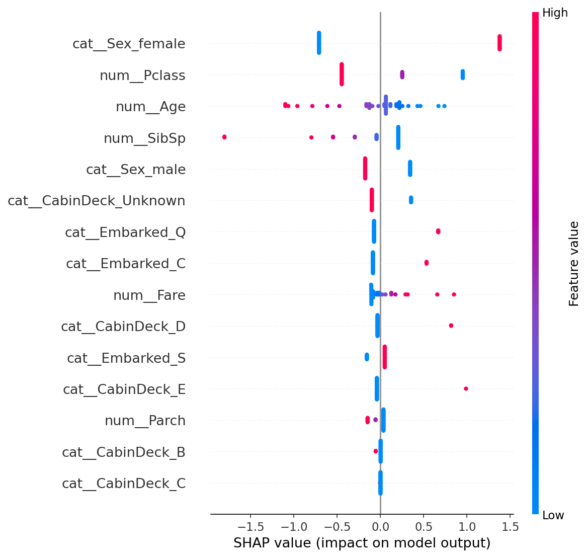
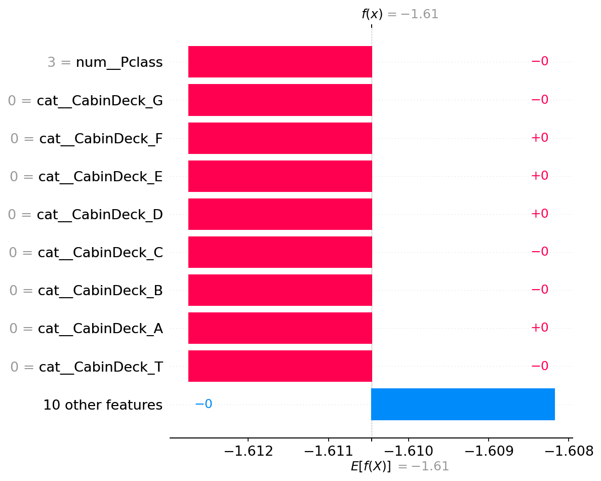

# Credit Risk Probability Model for Alternative Data

[](https://github.com/REPLACE_ME/credit-risk-model-main/actions/workflows/ci.yml)

Production-style machine learning project that estimates borrower default risk
from tabular alternative data, with testing, CI, and model explainability.

## Business Problem

Financial institutions need risk scoring that is not only predictive, but also
reliable and explainable. Black-box models can create governance risk under
regulatory expectations (e.g., Basel-style transparency needs). This project
demonstrates how to turn an ML prototype into an auditable and stakeholder-ready
risk scoring system.

## Solution Overview

- Build a modular training and inference pipeline in `src/`.
- Add robust preprocessing for missing values and mixed feature types.
- Train a deterministic baseline classifier for stable deployment behavior.
- Add SHAP explainability for global and local model transparency.
- Expose results through a Streamlit dashboard for non-technical users.
- Enforce quality with `pytest` tests and GitHub Actions CI.

## Key Results

- Metric 1: **ROC AUC = 0.840** on validation data.
- Metric 2: **Accuracy = 80.45%** with threshold `0.5`.
- Metric 3: **Engineering reliability improved** from 0 automated tests/CI to
  `5` passing tests with CI quality gates enabled.

> Label mapping note: dataset target is `Survived` (1 = good outcome).  
> Finance-facing risk is reported as:  
> `default_risk_prob = 1 - P(Survived = 1)`.

## Quick Start

```bash
git clone https://github.com/username/project
cd project
pip install -r requirements.txt
py -3.11 -m src.train --data-path "data/raw/train.csv"
streamlit run dashboard/streamlit_app.py
```

## Project Structure

```text
credit-risk-model-main/
├── .github/
│   └── workflows/
│       └── ci.yml
├── artifacts/
│   ├── metrics.json
│   ├── model.joblib
│   ├── shap_global.png
│   └── shap_local.png
├── dashboard/
│   └── streamlit_app.py
├── data/
│   └── raw/
│       └── train.csv
├── docs/
│   ├── task1_gap_analysis_and_improvement_plan.md
│   ├── task2_evidence.md
│   └── technical_report.md
├── src/
│   ├── api/
│   ├── explainability/
│   ├── features/
│   ├── models/
│   ├── config.py
│   ├── constants.py
│   ├── data_processing.py
│   ├── predict.py
│   └── train.py
├── tests/
│   ├── conftest.py
│   ├── test_explainability.py
│   ├── test_feature_engineering.py
│   ├── test_predict.py
│   ├── test_preprocessing.py
│   └── test_training.py
└── README.md
```

## Demo

- Dashboard (local): `streamlit run dashboard/streamlit_app.py`
- SHAP global explanation:



- SHAP local explanation:



## Technical Details

- **Data (source and preprocessing)**  
  Uses tabular passenger-style data in `data/raw/train.csv` as a proxy credit
  risk dataset. Preprocessing includes:
  - missing value imputation (median for numeric, most frequent for categorical)
  - one-hot encoding for categorical variables
  - derived feature `CabinDeck`
  - removal of non-predictive/high-cardinality fields

- **Model (algorithm and hyperparameters)**  
  Model: `LogisticRegression` (deterministic baseline for interpretability)  
  Key parameters:
  - solver: `liblinear`
  - max_iter: `400`
  - C: `1.0`

- **Evaluation (metrics and validation)**  
  - stratified train/validation split (`test_size = 0.2`, `random_state = 42`)
  - primary metrics: ROC AUC and accuracy
  - output persisted in `artifacts/metrics.json`
  - automated checks: `pytest` + CI workflow

## Future Improvements

- Add probability calibration (Platt/isotonic) for risk pricing use cases.
- Track drift and population stability (PSI) over time.
- Add fairness diagnostics across sensitive attributes.
- Version artifacts with model registry and release tagging.
- Deploy API + dashboard with containerized infrastructure.

## Author

- **Name:** Your Name
- **LinkedIn:** https://www.linkedin.com/in/your-profile
- **Contact:** your.email@example.com

## Submission Links

- **Technical report:** `docs/technical_report.md` (export to PDF for final
  submission if required)
- **GitHub repository:** https://github.com/username/project
